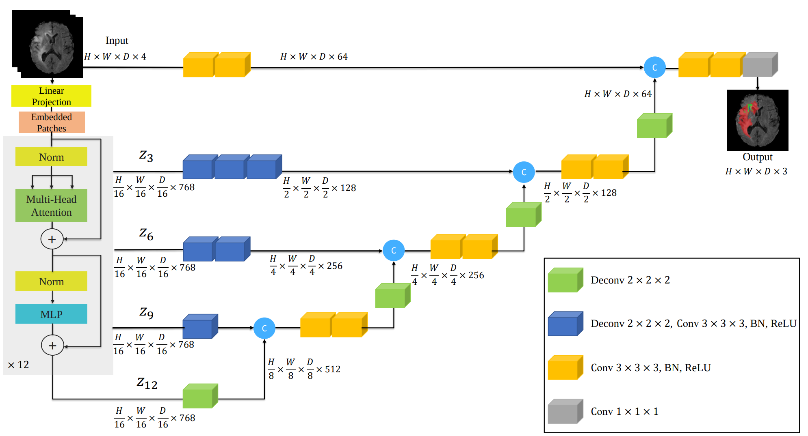
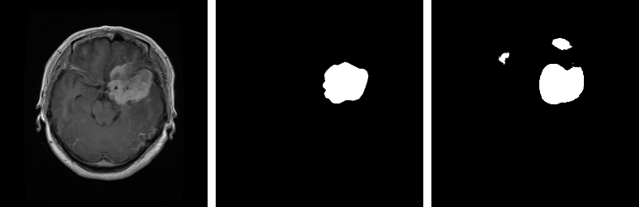
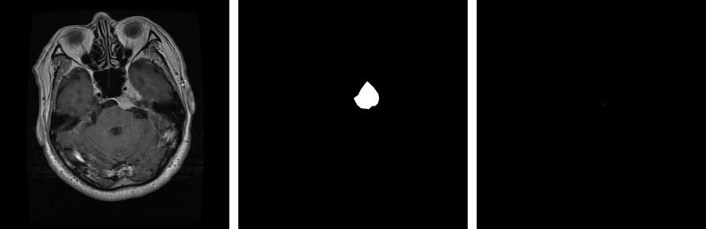
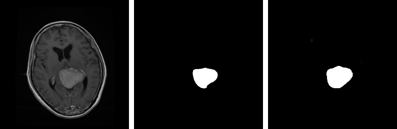
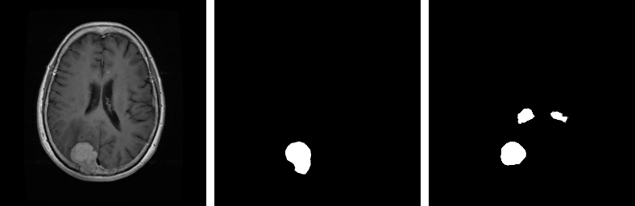

This project demonstrates the utilization of UNETR for brain tumor segmentation.

## Architecture

|  |
| :--: |
| *The block diagram of the Original UNETR model.* |

## Dataset
The dataset contains 3064 pairs of MRI brain images and their respective binary mask indicating tumor.
   
Dataset: [Brain Tumor Segmentation](https://figshare.com/articles/dataset/brain_tumor_dataset/1512427)

## Results
The sequence in the images below is `Input Image`, `Ground Truth` and `Prediction`.    
|  |
| :--: |
|  |
|  |
|  |
|  |
